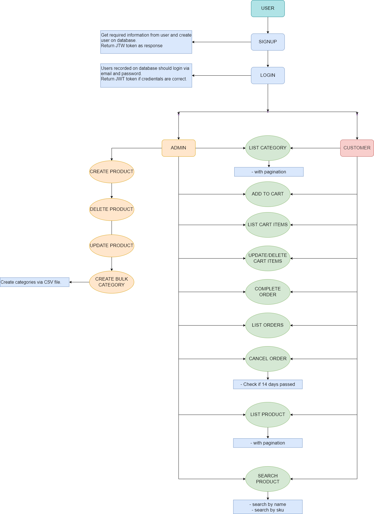

# Shopping Cart RestAPI - Picus Security Golang Bootcamp Graduation Project

A shopping cart RestAPI for basic shopping operations. This is the graduation project for Golang Backend Web Development Bootcamp organized by patika.dev&Picus Security.

## Table of Contents

- [Setup](#setup)
- [Technologies](#technologies)
- [Usage](#usage)
- [Contact](#contact)
- [License](#license)

## Setup

- Golang: You must have golang installed on your PC. To run the server, type "go run main.go" command in your terminal.
- Postgresql: Config file created according to postgresql database. To initialize you must have a database name "cart".

To run this project you must have Golang installed in your PC. Also

## Technologies

- Gin
- Postgresql
- Gorm
- JWT
- Go-swagger
- Viper
- Zap

## Usage

To see the visual representation of API endpoints you can visit live site [here](https://app.swaggerhub.com/apis/CartRestAPI/shopping-cart_rest_api/1.0.0).

There are 5 main endpoint groups:

- Auth
- Category
- Product
- Cart
- Order

### Auth Endpoint

```http
POST {{baseUrl}}/user/signup<!-- Gets required information from request body. Creates user on db and returns JWT tokens. -->
POST {{baseUrl}}/user/login <!-- Gets required information from request body. Logs user into system according to given email and password and returns JWT tokens. -->
```

### Category

```http
GET {{baseUrl}}/category/?page=1&pageSize=10 <!-- lists all active and available categories -->
POST {{baseUrl}}/category/create <!-- creates bulk categories according to uploaded csv file -->
```

### Product

```http
POST {{baseUrl}}/products/ <!-- Creates product on the db by given request body. Admin access only.-->
PUT {{baseUrl}}/products/<!-- Updates product on the db by given request body. Admin access only. -->
DELETE {{baseUrl}}/products/:sku <!-- Deletes product on the db by given parameter. Admin access only. -->
GET {{baseUrl}}/products/ <!-- lists all active and available products on db. All access -->
GET {{baseUrl}}/products/search/:queryparam <!-- Searches products by the given product name or sku. All access-->
```

### Cart

```http
POST {{baseUrl}}/cart/item?itemId=&quantity= <!-- Adds given item with given quantity to users's cart. Gets userID information from Auth Header. User access-->
GET {{baseUrl}}/cart/ <!--Lists items in the users' cart. Gets userID information from Auth Header. User access-->
DELETE {{baseUrl}}/cart/item/:itemid <!-- Deletes item in the users' cart by the given parameters. Gets userID information from Auth Header. User access-->
DELETE {{baseUrl}}/cart/item/:itemId/quantity/:quantity <!-- Updates item in the users' cart by the given parameters. Gets userID information from Auth Header. User access-->
```

### Order

```http
POST {{baseUrl}}/orders/ <!-- Creates order according to users' cart. Gets userID information from Auth Header. User access-->
GET {{baseUrl}}/orders/<!--Lists orders of the user. Gets userID information from Auth Header. User access-->
DELETE {{baseUrl}}/orders/:id <!-- cancels order if it has not been 14 days since ordered. Gets userID information from Auth Header. User access-->
```

---

Simple Endpoint Operations Chart:



## Contact

Created by [@horzu](https://horzu.github.io/) - feel free to contact me!

## License

[MIT](https://choosealicense.com/licenses/mit/)
